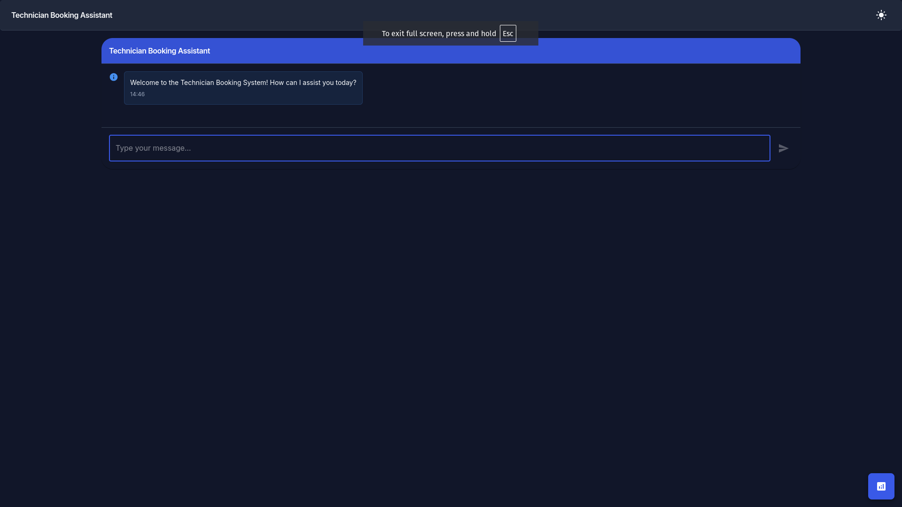
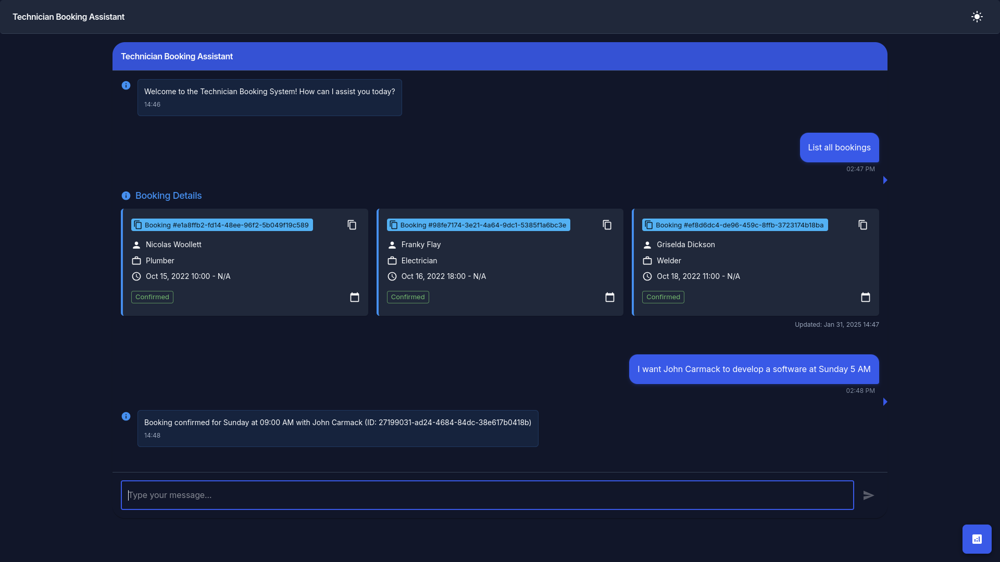
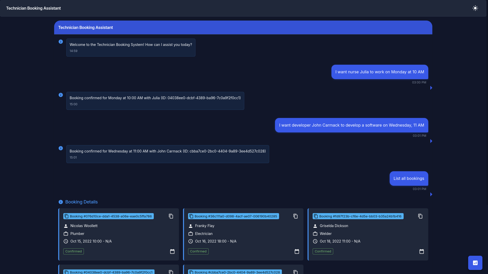
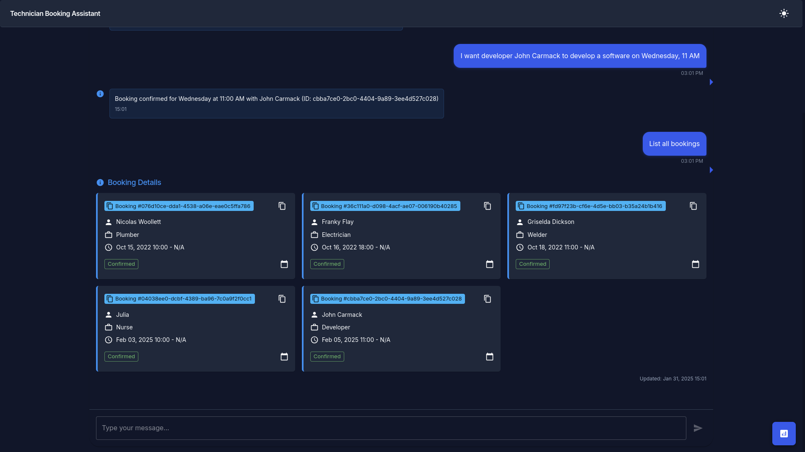
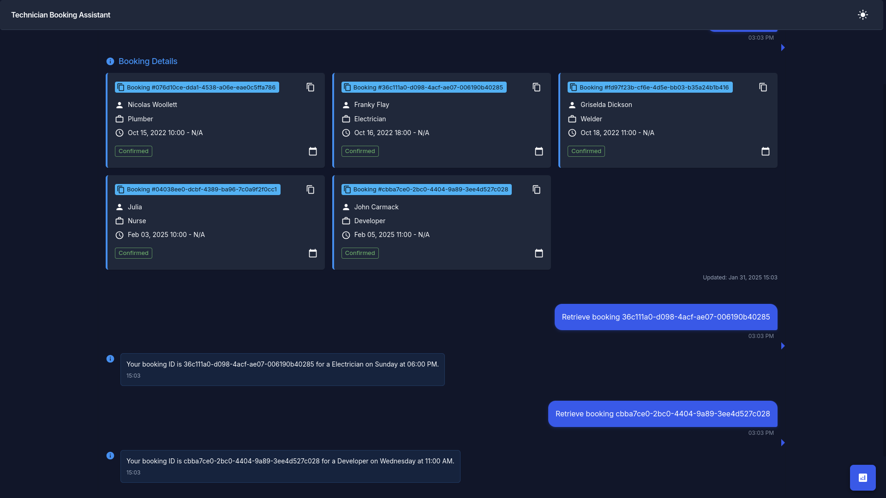
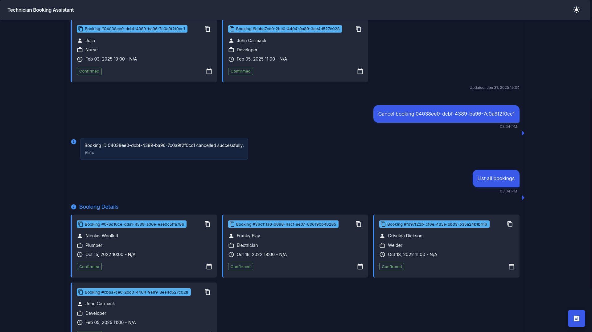

# Technician Booking Frontend

A sleek frontend application for managing technician bookings, built with **React**, **TypeScript**, and **Material UI**. This application offers an intuitive interface for viewing, searching, and managing bookings, complemented by a real-time chat interface for seamless communication.

## Table of Contents

- [Features](#features)
- [Technologies](#technologies)
- [Screenshots](#screenshots)
- [Prerequisites](#prerequisites)
- [Installation](#installation)
- [Usage](#usage)
- [Project Structure](#project-structure)
- [Contributing](#contributing)
- [License](#license)
- [Contact](#contact)

## Features

- **Responsive Design**: Optimized for both desktop and mobile devices.
- **Dark and Light Themes**: Toggle between dark and light modes for enhanced user experience.
- **Booking Management**: View, search, and filter bookings with real-time status updates.
- **Real-time Chat Interface**: Communicate with customers and technicians seamlessly.
- **Accessibility**: High-contrast designs and keyboard navigability ensure usability for all users.
- **Performance Optimizations**: Efficient rendering and state management for a smooth user experience.

## Technologies

- **React**: A JavaScript library for building user interfaces.
- **TypeScript**: A strongly typed programming language that builds on JavaScript.
- **Material UI (MUI)**: A popular React UI framework for building responsive, accessible, and customizable interfaces.
- **Vite**: A fast frontend build tool and development server.
- **Axios**: A promise-based HTTP client for making API requests.
- **ESLint**: A tool for identifying and reporting on patterns in JavaScript, ensuring code quality.

## Screenshots

  
*Figure 1: Screenshot 00*


*Figure 2: Screenshot 01*

  
*Figure 3: Screenshot 02*


*Figure 4: Screenshot 03*


*Figure 5: Screenshot 04*


*Figure 6: Screenshot 05* 


*Figure 7: Screenshot 06*

## Prerequisites

- **Node.js**: Ensure you have Node.js (version 18 or above) installed. You can download it from [here](https://nodejs.org/).
- **pnpm**: We recommend using pnpm as the package manager for this project. Follow the [installation instructions](https://pnpm.io/installation) to set up pnpm on your system.

## Installation 

1. **Clone the Repository**

   ```bash
   git clone https://github.com/ericsonwillians/technician-booking-frontend.git
   cd technician-booking-frontend
   ```

2. **Install Dependencies**

   Using pnpm (recommended):

   ```bash
   pnpm install
   ```

3. **Configure Environment Variables**

   Create a `.env` file in the root directory and add necessary environment variables, such as the backend API URL.

   ```env
   VITE_API_BASE_URL=http://127.0.0.1:8000
   ```

4. **Start the Development Server**

   ```bash  
   pnpm dev
   ```

   The application will be available at `http://localhost:5173` by default.

## Usage

- **Viewing Bookings**: Access the booking list to view all technician bookings. Use the search bar to filter bookings based on customer name, technician, or profession.
- **Theme Toggle**: Click on the theme toggle button in the AppBar to switch between light and dark modes.
- **Chat Interface**: Utilize the chat interface to communicate with customers or technicians in real-time.  
- **Responsive Design**: The layout adapts seamlessly to various screen sizes, ensuring usability across devices.

## Project Structure

```
technician-booking-frontend/
├── public
│   └── vite.svg
├── README.md
├── src
│   ├── App.css
│   ├── App.tsx
│   ├── assets
│   │   └── screenshots
│   │       ├── 00.png
│   │       ├── 01.png
│   │       ├── 02.png
│   │       ├── 03.png
│   │       ├── 04.png
│   │       ├── 05.png  
│   │       └── 06.png
│   ├── components
│   │   ├── BookingAnalytics.tsx
│   │   └── ChatInterface
│   │       ├── BookingEntry.tsx
│   │       ├── index.tsx
│   │       ├── SystemMessage.tsx
│   │       └── UserMessage.tsx
│   ├── index.css 
│   ├── main.tsx
│   ├── services
│   │   └── bookingApi.ts
│   ├── theme  
│   │   └── index.ts
│   └── vite-env.d.ts
├── tsconfig.app.json
├── tsconfig.json
├── tsconfig.node.json  
└── vite.config.ts
```

- **components/**: Contains reusable React components like BookingAnalytics, ChatInterface, and related subcomponents.
- **services/**: Contains API service files, such as bookingApi.ts for interacting with the backend.
- **theme/**: Contains theme configuration and customization files.
- **assets/**: Contains static assets like screenshots.
- **App.tsx**: The main application component.
- **main.tsx**: Entry point of the React application.
- **vite.config.ts**: Configuration file for Vite.

## Contributing

Contributions are welcome! Please follow these steps to contribute:

1. **Fork the Repository** 

2. **Create a Feature Branch**

   ```bash
   git checkout -b feature/YourFeatureName
   ```

3. **Commit Your Changes**

   ```bash
   git commit -m "Add Your Feature"  
   ```

4. **Push to the Branch** 

   ```bash
   git push origin feature/YourFeatureName
   ``` 

5. **Open a Pull Request**

Please ensure your code adheres to the project's coding standards and passes all linting and testing checks.

## License

This project is licensed under the [MIT License](LICENSE).

## Contact

**Ericson Willians**  
Email: [ericsonwillians@protonmail.com](mailto:ericsonwillians@protonmail.com)
GitHub: [@ericsonwillians](https://github.com/ericsonwillians)

---

Let me know if you have any other questions or need further assistance with your project!